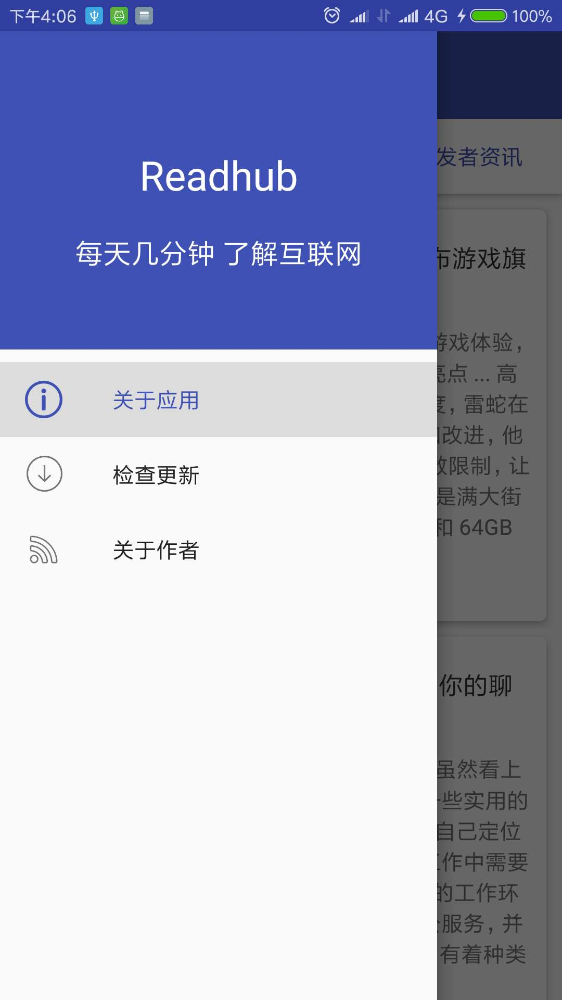

# ReadhubClient
## 说明
本应用为Readhub的客户端，非官方应用，主要是为了实践Android最新开发组件

采用的技术栈为Kotlin+Retrofit+RxJava+LiveData+ViewModel+LifeCycle

代码地址：https://github.com/dumingxin/ReadhubClient

## 界面截图

        

## 下载地址
二维码

酷安

https://www.coolapk.com/apk/166355

## Next

加入对Room和Paging的使用

